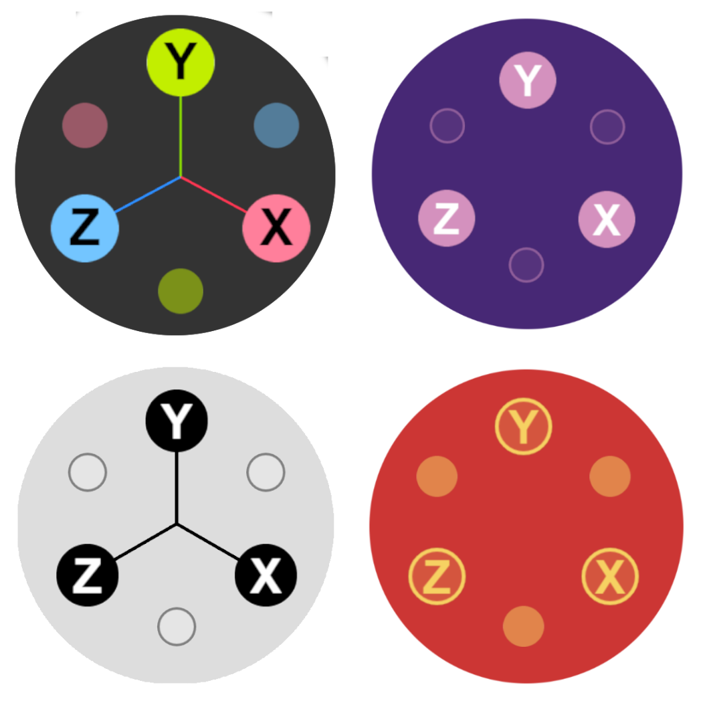

<h1 align="center">Three Viewport Gizmo</h1>

<p align="center">
  <a href="https://fennec-hub.github.io/three-viewport-gizmo/">
  
  </a>
</p>

<a href="https://fennec-hub.github.io/three-viewport-gizmo/">**Three Viewport Gizmo**</a> is a highly customizable standalone interactive version of the official [three.js viewport helper](https://github.com/mrdoob/three.js/blob/dev/examples/jsm/helpers/ViewHelper.js), it can be used alone or in conjuncture with [OrbitControls](https://threejs.org/docs/#examples/en/controls/OrbitControls) or custom camera controllers like [@yomotsu/camera-controls](https://github.com/yomotsu/camera-controls).

<h3 align="center">
  📚 <a href="https://fennec-hub.github.io/three-viewport-gizmo/">Documentation</a> -
  🚀 <a href="https://fennec-hub.github.io/three-viewport-gizmo/quickstart">Quickstart</a> -
  🛠️ <a href="https://fennec-hub.github.io/three-viewport-gizmo/api ">API</a> -
  ⚡️ <a href="https://fennec-hub.github.io/three-viewport-gizmo/examples/orbit-controls">Examples</a>
</h3>

---

## Quick Start

### Try it Online

You can try ViewportGizmo directly in your browser on [jsFiddle](https://jsfiddle.net/nq5se98L/).

### Installation

```sh
npm install three-viewport-gizmo
```

### Usage

```js
import * as THREE from "three";
import { OrbitControls } from "three/addons/controls/OrbitControls.js";
import { ViewportGizmo } from "three-viewport-gizmo";

//... Initialize your Scene

const controls = new OrbitControls(camera, renderer.domElement);
const gizmo = new ViewportGizmo(camera, renderer);

gizmo.attachControls(controls);

// Render
function animation(time) {
  //... Scene's animations and render

  gizmo.render();
}

// Resize
window.onresize = () => {
  //... Scene's resize logic

  gizmo.update();
};
```

## Acknowledgments

- Thanks to the [Three.js](https://threejs.org/) community for their amazing work.
- This library was inspired from the official [Three.js Viewport Helper](https://github.com/mrdoob/three.js/blob/dev/examples/jsm/helpers/ViewHelper.js).

## License

This project is licensed under the MIT License

### Contribution and Support

If you have any questions or need support, feel free to [open an issue](https://github.com/Fennec-hub//three-viewport-gizmo/issues).

Contributions are welcome! Fork the repository, make your changes, and submit a pull request.
